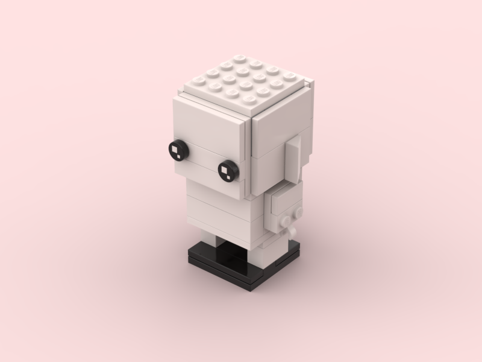

# 00: Base

This is the base model from Lego Set **#41597**, that I use to start my new builds. It is an important reference regarding overall geometry and different body parts size and height.  

Rendered preview:

## Contents:

- [base.io](base.io): stud.io binary model file
- [base.png](base.png): rendered preview

> ℹ️ #41597 set instructions available [here](https://www.lego.com/en-my/service/buildinginstructions/search?initialsearch=41597#?text=41597).
